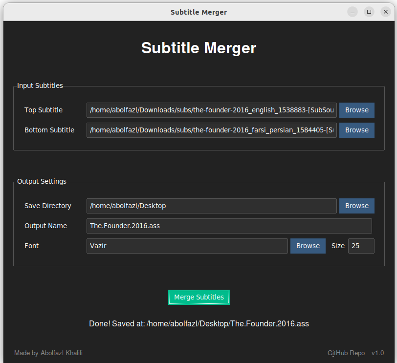
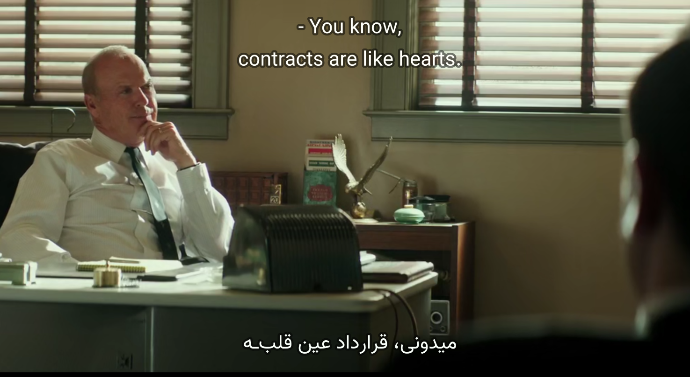

# Subtitle Merger

[](https://www.python.org/downloads/)
[](https://opensource.org/licenses/MIT)
[](https://github.com/ixabolfazl/subtitle-merger/issues)
[](https://github.com/ixabolfazl/subtitle-merger/stargazers)


Subtitle Merger is a Python application with a graphical user interface that allows users to merge two subtitle files into a single ASS (Advanced SubStation Alpha) subtitle file. This tool is particularly useful for combining subtitles in different languages or for adding both dialogue and narrative subtitles to a video.

## Screenshot





## Features

- Merge two SRT, ASS, or SSA subtitle files into a single ASS file
- Automatically detect and handle various text encodings, including Persian
- Customize font and font size for the output subtitles
- Automatically guess the output filename based on input file names
- User-friendly graphical interface built with tkinter and ttkbootstrap
- Cross-platform compatibility (Windows, Linux)
- Enhanced compatibility with VLC Media Player (recommended)

## Installation

1. Clone this repository:
   ```bash
   git clone https://github.com/ixabolfazl/subtitle-merger.git
   cd subtitle-merger
   ```

2. Install the required dependencies:
   ```bash
   pip install -r requirements.txt
   ```

## Usage

1. Run the application:
   ```bash
   python main.py
   ```

2. Use the "Browse" buttons to select your input subtitle files (top and bottom).

3. (Optional) Choose a save directory for the output file.

4. (Optional) Adjust the output filename, font, and font size.

5. Click "Merge Subtitles" to process the files.

6. The status of the operation will be displayed at the bottom of the window.

## Acknowledgments

We would like to express our gratitude to the following individuals who have contributed to the development and testing of this project:

- [Sina Ansari](https://github.com/sina933)
- [2077DevWave](https://github.com/2077DevWave)
- [ArminDM](https://github.com/MrArminDM)
- [Matin Heidarnejad](https://github.com/matinheidarnejad)
- [Amir Hossein "Amiria" Maher](https://github.com/amiria703)

## Contributing

Contributions to Subtitle Merger are welcome! Please feel free to submit a Pull Request.

## License

This project is licensed under the MIT License - see the [LICENSE](LICENSE) file for details.

## Contact

For any queries or suggestions, please open an issue on the GitHub repository.


